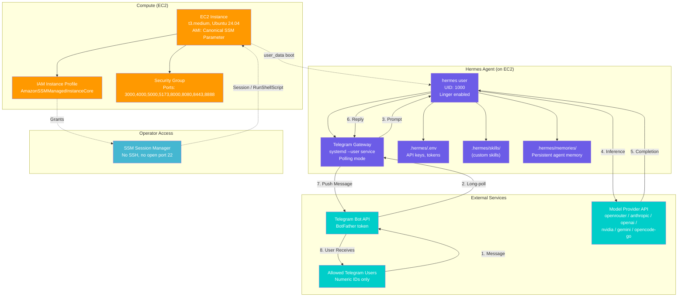
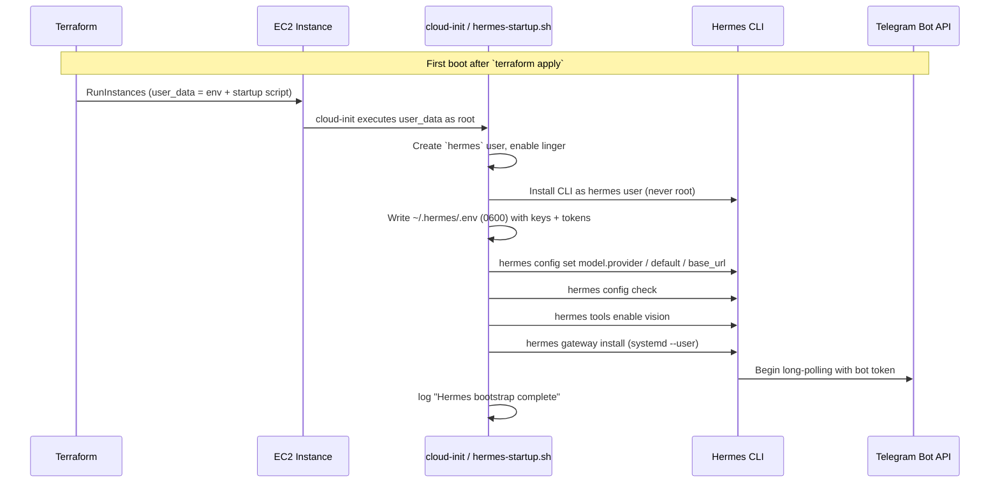
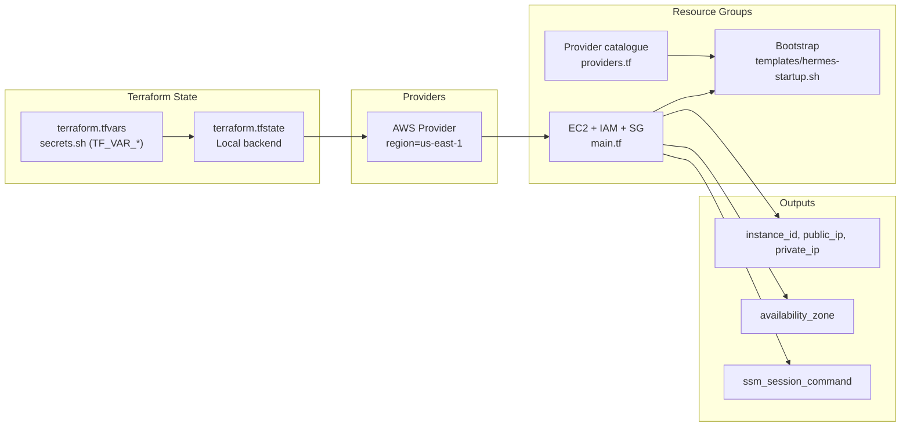
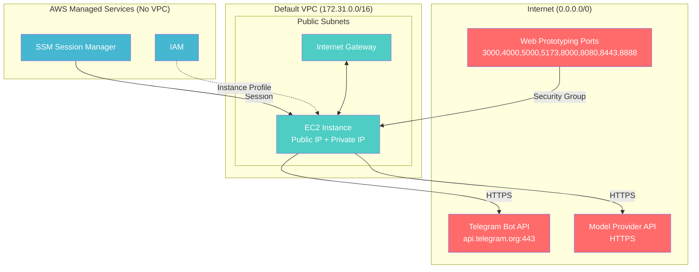
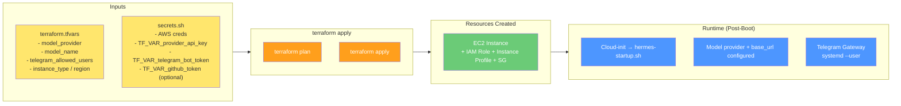

# System Architecture Diagram

This document contains Mermaid diagrams showing the terra-hermes AWS infrastructure.

---

## Complete System Architecture



---

## Bootstrap Flow (Sequence Diagram)



---

## Infrastructure Deployment (Terraform Resources)



---

## Network & Security Boundaries



> **Note:** all listed inbound ports are open to `0.0.0.0/0` for prototyping
> convenience. There is no inbound SSH — operator access is via SSM Session
> Manager only. Use this on trusted, non-production accounts.

---

## Data Flow Summary



---

## How to Render

### VS Code / GitHub / GitLab
Mermaid renders natively in Markdown files.

### CLI (Mermaid CLI)
```bash
# Install
npm install -g @mermaid-js/mermaid-cli

# Render to SVG
mmdc -i Docs/ARCHITECTURE.md -o architecture.svg

# Render to PNG
mmdc -i Docs/ARCHITECTURE.md -o architecture.png -b transparent
```

### Online Editors
- [Mermaid Live Editor](https://mermaid.live/)
- [Markdown Preview Enhanced](https://shd101wyy.github.io/markdown-preview-enhanced/) (VS Code extension)

---

## Diagram Source

All diagrams are embedded in this Markdown file. To extract a specific diagram, copy the code block between `\`\`\`mermaid` and `\`\`\``.
