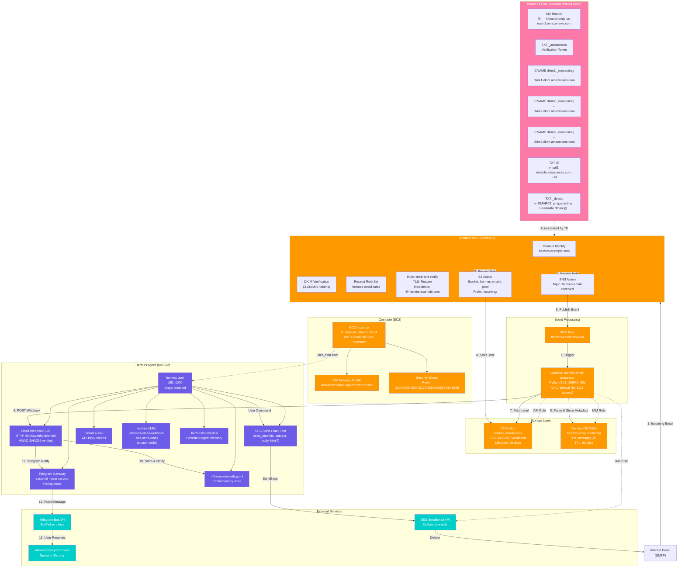
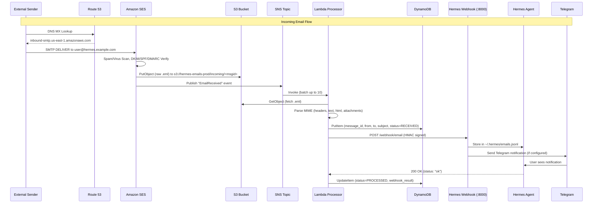
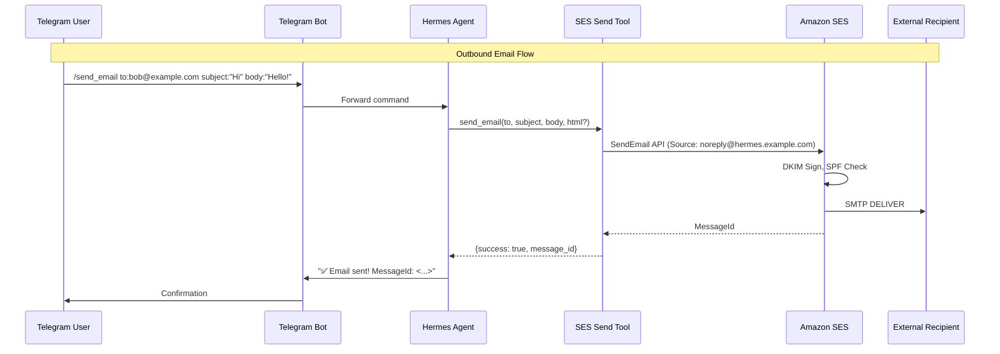

# System Architecture Diagram

This document contains Mermaid diagrams showing the terra-hermes AWS infrastructure with SES email integration.

---

## Complete System Architecture



---

## Email Receive Flow (Sequence Diagram)



---

## Email Send Flow (Sequence Diagram)



---

## Infrastructure Deployment (Terraform Resources)

```mermaid
flowchart LR
    subgraph TF["Terraform State"]
        TF_VAR["terraform.tfvars\nsecrets.sh (TF_VAR_*)"]
        TF_STATE["terraform.tfstate\nLocal backend"]
    end

    end

    subgraph PROVIDERS["Providers"]
        AWS["AWS Provider\nregion=us-east-1"]
    end

    subgraph MODULES["Resource Groups"]
        EC2_GRP["EC2 + IAM + SG\nmain.tf"]
        SES_GRP["SES + Route53 + S3 + SNS\nses.tf"]
        LAMBDA_GRP["Lambda + IAM + DynamoDB\nlambda.tf"]
        BOOT["Bootstrap\ntemplates/hermes-startup.sh"]
    end

    subgraph OUTPUTS["Outputs"]
        OUT_INSTANCE["instance_id, public_ip, private_ip"]
        OUT_SES["ses_domain_verification_token, ses_dkim_tokens, ses_mx_endpoint"]
        OUT_LAMBDA["email_processor_lambda_arn"]
        OUT_DDB["email_metadata_table"]
        OUT_SSM["ssm_session_command"]
    end

    TF_VAR --> TF_STATE
    TF_STATE --> AWS
    AWS --> EC2_GRP
    AWS --> SES_GRP
    AWS --> LAMBDA_GRP
    EC2_GRP --> BOOT
    EC2_GRP --> OUT_INSTANCE
    EC2_GRP --> OUT_SSM
    SES_GRP --> OUT_SES
    LAMBDA_GRP --> OUT_LAMBDA
    LAMBDA_GRP --> OUT_DDB
```

---

## Network & Security Boundaries

```mermaid
flowchart TD
    subgraph INTERNET["Internet (0.0.0.0/0)"]
        EMAIL_IN["Incoming SMTP\nPort 25/587/2587"]
        EMAIL_OUT["Outbound SES API\nHTTPS"]
        TG_API["Telegram Bot API\napi.telegram.org:443"]
        WEB_PORTS["Web Prototyping Ports\n3000,4000,5000,5173,8000,8080,8443,8888"]
    end

    subgraph VPC["Default VPC (172.31.0.0/16)"]
        subgraph PUBLIC["Public Subnets"]
            EC2_PUB["EC2 Instance\nPublic IP + Private IP"]
            IGW["Internet Gateway"]
        end
        subgraph PRIVATE["Private Subnets (if any)"]
            LAMBDA_VPC["Lambda ENIs\n(if VPC configured)"]
        end
    end

    subgraph AWS_MANAGED["AWS Managed Services (No VPC)"]
        SES_SVC["Amazon SES"]
        S3_SVC["S3"]
        SNS_SVC["SNS"]
        LAMBDA_SVC["Lambda Control Plane"]
        DDB_SVC["DynamoDB"]
        R53_SVC["Route 53"]
        IAM_SVC["IAM"]
        SSM_SVC["SSM Session Manager"]
    end

    %% Connections
    EMAIL_IN -->|MX → SES| SES_SVC
    SES_SVC -->|Receipt Rule| S3_SVC
    SES_SVC -->|Receipt Rule| SNS_SVC
    SNS_SVC -->|Invoke| LAMBDA_SVC
    LAMBDA_SVC -->|GetObject| S3_SVC
    LAMBDA_SVC -->|PutItem| DDB_SVC
    LAMBDA_SVC -->|HTTP :8000| EC2_PUB
    EC2_PUB -->|HTTPS| TG_API
    EC2_PUB -->|HTTPS| SES_SVC
    EC2_PUB -->|HTTPS| S3_SVC
    EC2_PUB -->|HTTPS| DDB_SVC
    WEB_PORTS -->|Security Group| EC2_PUB
    SSM_SVC -->|Session| EC2_PUB

    %% VPC Flow
    IGW <--> EC2_PUB
    EC2_PUB -.->|VPC Endpoints (optional)| S3_SVC
    EC2_PUB -.->|VPC Endpoints (optional)| DDB_SVC

    classDef internet fill:#FF6B6B,color:#fff
    classDef vpc fill:#4ECDC4,color:#fff
    classDef managed fill:#45B7D1,color:#fff

    class EMAIL_IN,EMAIL_OUT,TG_API,WEB_PORTS internet
    class EC2_PUB,IGW,LAMBDA_VPC vpc
    class SES_SVC,S3_SVC,SNS_SVC,LAMBDA_SVC,DDB_SVC,R53_SVC,IAM_SVC,SSM_SVC managed
```

---

## Data Flow Summary

```mermaid
flowchart LR
    subgraph INPUT["Inputs"]
        TFVARS["terraform.tfvars\n- ses_domain\n- route53_hosted_zone_name\n- email_s3_bucket_name\n- enable_email_processing"]
        SECRETS["secrets.sh\n- AWS creds\n- TF_VAR_provider_api_key\n- TF_VAR_telegram_bot_token\n- TF_VAR_telegram_allowed_users\n- TF_VAR_hermes_webhook_secret"]
    end

    subgraph DEPLOY["terraform apply"]
        PLAN["terraform plan"]
        APPLY["terraform apply"]
    end

    subgraph CREATED["Resources Created"]
        EC2_INST["EC2 Instance\n+ IAM Role + SG"]
        SES_DOMAIN["SES Domain Identity\n+ DKIM + MX + SPF + DMARC"]
        S3_BUCKET["S3 Bucket\n+ Policy + Lifecycle"]
        SNS_TOPIC["SNS Topic"]
        RECEIPT_RULE["SES Receipt Rule\n(S3 + SNS actions)"]
        LAMBDA_FN["Lambda Function\n+ IAM Role + Event Source"]
        DDB_TABLE["DynamoDB Table\n+ TTL"]
        R53_RECORDS["Route 53 Records\n(MX, TXT, CNAME×3, SPF, DMARC)"]
    end

    subgraph RUNTIME["Runtime (Post-Boot)"]
        HERMES_BOOT["Cloud-init → hermes-startup.sh"]
        SKILLS_INSTALLED["Skills Installed\n- hermes-email-webhook\n- ses-send-email"]
        WEBHOOK_RUNNING["Webhook Server\n:8000/webhook/email"]
        TG_GATEWAY["Telegram Gateway\nsystemd --user"]
    end

    INPUT --> DEPLOY
    DEPLOY --> CREATED
    CREATED --> RUNTIME

    classDef input fill:#FFE66D,color:#333
    classDef deploy fill:#FF9F1C,color:#fff
    classDef created fill:#6BCB77,color:#fff
    classDef runtime fill:#4D96FF,color:#fff

    class TFVARS,SECRETS input
    class PLAN,APPLY deploy
    class EC2_INST,SES_DOMAIN,S3_BUCKET,SNS_TOPIC,RECEIPT_RULE,LAMBDA_FN,DDB_TABLE,R53_RECORDS created
    class HERMES_BOOT,SKILLS_INSTALLED,WEBHOOK_RUNNING,TG_GATEWAY runtime
```



---

## How to Render

### VS Code / GitHub / GitLab
Mermaid renders natively in Markdown files.

### CLI (Mermaid CLI)
```bash
# Install
npm install -g @mermaid-js/mermaid-cli

# Render to SVG
mmdc -i Docs/ARCHITECTURE.md -o architecture.svg

# Render to PNG
mmdc -i Docs/ARCHITECTURE.md -o architecture.png -b transparent
```

### Online Editors
- [Mermaid Live Editor](https://mermaid.live/)
- [Markdown Preview Enhanced](https://shd101wyy.github.io/markdown-preview-enhanced/) (VS Code extension)

---

## Diagram Source

All diagrams are embedded in this Markdown file. To extract a specific diagram, copy the code block between `\`\`\`mermaid` and `\`\`\``.